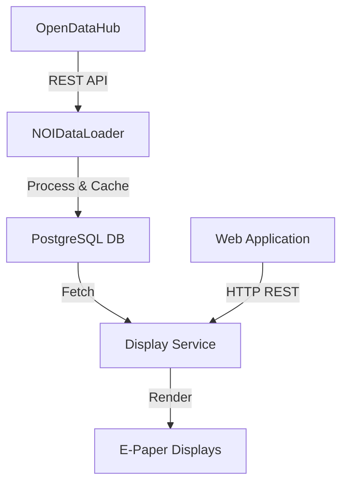
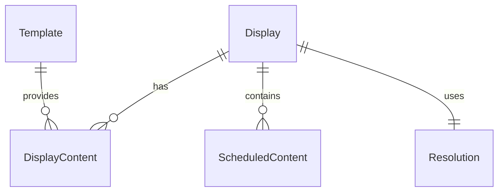

<!--
SPDX-FileCopyrightText: NOI Techpark <digital@noi.bz.it>

SPDX-License-Identifier: CC0-1.0
-->
# Open Data Hub E-Paper API Technical Documentation

## System Overview

The Open Data Hub E-Paper API is a sophisticated system that integrates data from Open Data Hub, processes it and displays it on E-Paper displays (totems) throughout the NOI Techpark. The system has several key components working together.

## Data Flow Architecture



## Core Components

### 1. Data Acquisition Layer

#### OpenDataRestService
- Primary interface for fetching data from OpenDataHub
- Handles HTTP communication with external APIs
- Endpoints:
	- Events data
	- Location/Places data
	- Event locations

```java
@Component
public class OpenDataRestService {
	public List<NOIPlaceData> getNOIPlaces() {
		NOIPlaceDto places = restTemplate.getForObject(placesUrl, NOIPlaceDto.class);
		return places != null ? places.getData() : new ArrayList<>();
	}
}
```

### 2. Data Processing Layer

#### NOIDataLoader
- Central component for data management
- Implements scheduled data fetching
- Maintains in-memory cache of events and places
- Key functionalities:
	- Periodic data refresh
	- Data transformation
	- Room-Event mapping

```java
@Component
public class NOIDataLoader {
	@Scheduled(cron = "${cron.opendata.events}")
	public void loadNoiTodayEvents() {
		// Fetch and cache events
	}

	@Scheduled(cron = "${cron.opendata.locations}")
	public void loadNoiPlaces() {
		// Fetch and cache places
	}
}
```

#### Scheduling Configuration
```properties
NOI_EVENTS_ENABLED=true
NOI_CRON_EVENTS=0 0 0/12 * * ?			# Every 12 hours
NOI_CRON_LOCATIONS=0 0/10 6-24 * * ?	# Every 10 minutes during operating hours
```

### 3. Data Storage Layer

#### PostgreSQL Database
- Stores persistent data:
	- Display configurations
	- Templates
	- Scheduled content
	- Display states
	- Room mappings



### 4. Display Management Layer

#### DisplayService
- Manages display states and content
- Handles content scheduling
- Processes image transformation
- Key operations:
	- Content assignment
	- Image processing
	- State synchronization
	- Event mapping

```java
@Service
public class DisplayService {
	public ResponseEntity<String> syncDisplayStatus(String displayUuid, DisplayStateDto stateDto) {
		// Update display state
		// Process images
		// Handle event data
	}
}

```

### 5. Room Management

#### RoomService
- Manages room data and mappings
- Integrates with NOI places data
- Provides room information for displays

```java
@Service
public class RoomService {
	public ArrayList<RoomDto> getAllRooms() {
		// Fetch and process room data
	}
}
```

## Data Processing Flow
1. **Data Acquisition**
- System fetches events and places from OpenDataHub
- Data is validated and transformed into DTs

2. **Data Processing**
- Events are filtered by room/location
- Content is scheduled based on event timing
- Images are processed for e-paper display

3. **Content Distribution**
- Processed content is assigned to specific display
- Content is convert to display-specific format
- Images are optimized for e-paper screens

4. **Display Synchronizaton**
- Displays poll for content updates
- Content is delivered based on schedule
- Display states are monitored and logged

## Show Events

**Note:** The cron jobs annotations don't need to be modified. Just if you prefer other update times.
The scheduler cron annotation works as follows:


Where */10 means every 10 seconds/minutes/, where 0/10 means every 10 seconds/minutes/... but starting from 0. For example, for minutes that would be `8:00`, `8:10` etc. See this [spring.io blog post](https://spring.io/blog/2020/11/10/new-in-spring-5-3-improved-cron-expressions) for more details.
